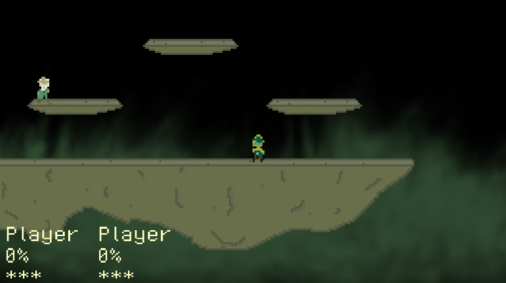

# GUT CHAMPION

## Summary

Gut Champion is a platformer fighter inspired by Super Smash Bros. The goal is to knock the enemy off stage. The more you hit your opponent, the more likely they are knocked off stage. Game is won when the opponent runs out of stocks.




## Documentation

### Server
Server code is simple multithreaded message server, which receives messages from clients and replicates them to all of the clients. This way all players are in sync.

### Client
Client sends player data from a thread to server. Client handles all game logic, so be mindful and don't cheat by modifying client code.
Graphics are rendered with [SDL](https://github.com/Rust-SDL2/rust-sdl2).

## Running

You can run the game by cloning this repository and running 

```cargo run --bin client``` for client and
```cargo run --bin server``` for server

You have options to connect to localhost, server ip configured by conf/conf or "Gut Arena", a hosted server which is sometimes up.
